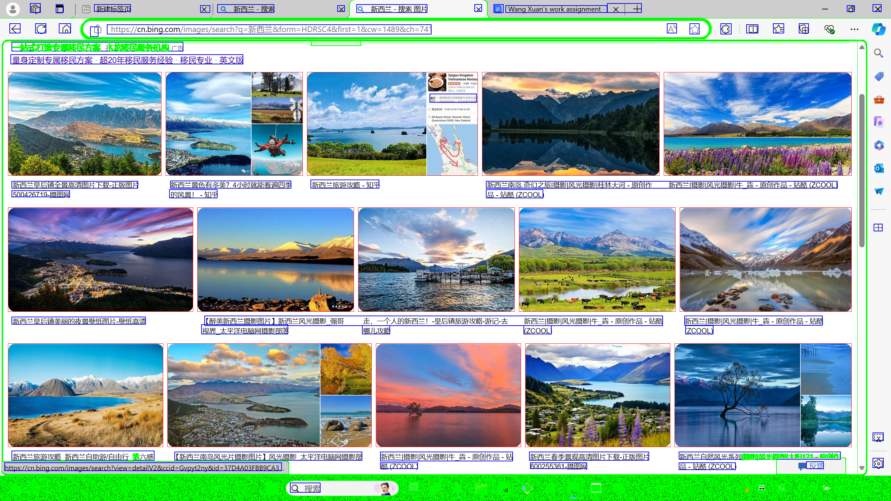
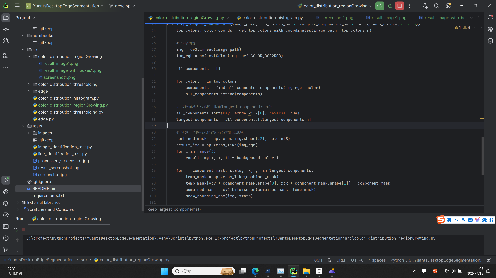

# YuantsDesktopEdgeSegmentation

## 1. 项目简介

此项目是AIDesktopagent项目(一种人工智能桌面代理，能够通过屏幕流与计算机系统交互，并通过光标和键盘动作提供输出

AI为你提供母语级高精翻译)的分支项目,用于处理计算机视觉相关问题:

从个人电脑执行电脑视觉分析截图, 包括但不限于:

1. 边缘检测, 文字、以线为基础的图标识别, 自然图像识别, 用于分割的直线识别, 图像分割
2. 利用api和相关论文中的现有模型完成传统的CV任务

## 2. 配置安装说明

1. 克隆该存储库或下载脚本到本地机器:

   ```python
   git clone https://github.com/your_username/your_repository.git
   cd your_repository
   ```

2. 创建并激活虚拟环境（推荐）：

   ```python
   python -m venv venv
   source venv/bin/activate  # 对于Windows用户，使用 `venv\Scripts\activate`
   ```

3. 依赖库

   确保已安装以下库： 

   numpy 

   pillow 

   scikit-learn
   ......
   
   你可以使用以下命令安装这些依赖项：

```python
pip install -r requirements.txt
```

## 3. 使用方法

要运行该脚本，请按照以下步骤操作：

1. 打开终端或命令提示符，并导航到脚本所在的目录
2. 使用 Python 运行脚本：

```python
python edge.py
```

运行该脚本后，将执行以下步骤：

1. 在延迟3秒后捕获屏幕截图并保存为 `screenshot0.png`

2. 使用简单差分法检测截图中的边缘

3. 保存边缘检测结果

4. 分类检测到的边缘元素，包括文本/图标、直线和不规则大形状(自然图像)

5. 从截图中提取文本和图标

6. 为直线添加标签

7. 为不规则大形状添加红色边框

8. 获取边缘图信息

9. 合并所有信息并生成带标签的可视化图像

10. 保存带标签的可视化图像为 `labeled_screenshot0.png`

## 4. 工作日志

2024-7-10

目前项目对于文字和以线为基础的图标的识别十分精准


利用腾讯云的api对图像中的文字进行识别, 注意配置环境变量, 即SECRET_ID和SECRET_KEY, 但是有一些靠近边缘部分而且有背景色的这些文字或图标较难识别.

下面是对于截屏中图像的识别:



从中可以看到, 对于相对分离的图片, 可以准确地对它们进行识别和标记.
但是有一些情况却很难对图片进行有效的识别, 如下图所示:


当图片边缘图的连通区域和其他连通域相连时, 识别的不准确, 尤其是和边框相连.

那么也有可能图片和图片相连,如下图所示:


从图中可以看出即使是图片相叠加, 也是可以识别出图像区域的, 但是和边界连通区相连时, 会被识别为边界.

也许可以尝试限定边缘像素的位置, 因为其实处于下方边栏部分的边缘像素对于图像的识别没有什么帮助.


在上图中我们可以看出, 图像如果和右边框相连, 那么也会被识别为用于分割的直线连通区域

所以也许我们可以先对边缘像素的坐标进行处理, 在识别图片时对边缘像素的位置进行限定, 十分靠下的像素(属于下边栏内部区域或过于靠近右侧边栏), 处理完之后将属于图像的坐标从边缘像素中除去.

之后识别用于分割的直线, 将已经删去图像坐标的边缘像素进一步限定(属于下边框的像素除去), 对直线进行识别

那么分割线的问题和图片问题在上述描述中以一并说到.

再尝试了其他用于识别嵌入图像和分割线的方法后, 发现有些效果很差, 有些则是需要大量的数据来进行训练, 都不是很合适, 所以选择对原算法进行进一步优化. 这些尝试在tests文件夹中可以找到(但也只是尝试中的一部分).

2024-7-11

今日通过昨天的设想对算法进行了优化,  在识别图片时对边缘像素的位置进行限定(四边进行限定)

下边是实例:


我们可以看到, 现在对于图片的识别十分准确(红色框框出, 当然也包括横向宽通的图片, 虽然之前定义其为非图片, 但是对比其他的类型像文字, 图标, 它还是有十分明显的区别)

当然也有识别不准确的时候,如下图所示:


这是因为右下角的图片边缘像素连通域中像素过少, 且占据矩形的比例过低, 但这种情况很少, 一般图像中边缘像素会占据大部分(成现为白色)


又比如上图, 我故意将截图放在和边缘线重合的地方, 此时识别也会不准确, 因为图片的连通域发生了极大的改变, 导致识别不准确, 正常情况下图片不会出现在分割线上.

下面测试几个随机截图


此图中,由于受到弹框的影响图片的连通区域像素变得很少, 导致识别不准确

分割的直线


当分割线没有受到其他连通域干扰时, 识别较为准确, 可以明显区分出来


但是当边框和其他连通区域, 尤其是小面积的其他区域黏连时, 不易于区分. (且一般边框和图像黏连时最难准确识别, 因为有时完整的图像只剩一小部分, 且它们总是和边框黏连, 使得两者都很难区分, 虽然已经对两者都进行了区域的限制, 但是每个页面往往是不同的, 对于有些边框较低的页面识别较差)

现在该项目对于两者的识别适用于边缘较为分散的情况, 但是准确度较之前有了很大的提高

2024-7-12

尝试不同的方法对图像进行以颜色为基础的图像分割

阈值转换法:

color_distribution_thresholding.py


在此文件中使用了阈值转换的方法对图像进行分割

对截图先进行颜色空间的转换(HSV：色调、饱和度、亮度)


而后作为测试, 将所有绿色的像素提取出来


我们可以看出提取的位置还是比较准确的, 下面是合并完之后的结果


但是阈值通常是人为设计的, 所以不能根据每张图片来变化阈值

```python
lower_bound = np.array([35, 100, 100])  # 示例值，需要根据实际情况调整
upper_bound = np.array([85, 255, 255])  # 示例值，需要根据实际情况调整
```

那么我们考虑优化此算法或将其替换.

下面采用直方图分析法

color_distribution_histogram.py

在此文件中使用了直方图分析法对图像进行分割

直方图分析法是在阈值转换法的基础上改进的方法,图像转换为HSV颜色空间后,计算色调直方图,找到直方图的峰值,例子中我选择的是前十的峰值, 合并完这些掩码之后,再应用到原始的图像上


像使用阈值转换法一样对图像进行处理后, 从上图中可以看出已经将直方图中前十的色调选出并合并到原图. 但是此法还是有不小的局限性, 因为HSV的色调不能显示所有的颜色, 比如:

1. **白色**：在HSV中，白色的饱和度为0，但是明度为最大值，这使得白色在该模型中不太容易定义
2. **黑色**：类似地，黑色的饱和度也为0，但明度为最小值，这也让黑色在HSV中不太容易描述
3. **灰色**：灰色是介于白色和黑色之间的中间色，它在HSV中的表示也可能不够准确
4. **粉色**：粉色是一种柔和的颜色，它可能需要通过多个色相值来描述，因为它不是单一的色相
5. **棕色**：棕色是由多种颜色混合而成，这种混合色在HSV中可能需要多个参数来描述

所以, 此方法存在一定局限性

又尝试了Region Growing Image Segmentation方法

先获取截图的10种像素最多的颜色以及它们的坐标, 对每种颜色，使用OpenCV的`connectedComponentsWithStats`函数查找连通域。记录每个连通域的大小、掩码、统计信息（包括位置和尺寸）。按连通域大小排序，并选择前10个最大的连通域。使用OpenCV绘制边界框。保存结果图像。

关键点:

为了解决内存分配问题:

**逐块处理图像**：在 `find_all_connected_components` 函数中，将图像分割成更小的块（如 512x512），逐块处理以减少内存占用。

**逐步合并结果**：在主循环中，逐步处理每个块的连通域，并直接应用于主掩码。

**避免大数组分配**：不再一次性创建大尺寸的 `full_component_mask`，而是在主循环中处理块级别的连通域。

实例如下:




因为内存的原因, 所以将本来可能大的连通域分割成小的区域所以导致大块的颜色连通域不完整, 这是需要进一步改进的

## 5. 联系信息

